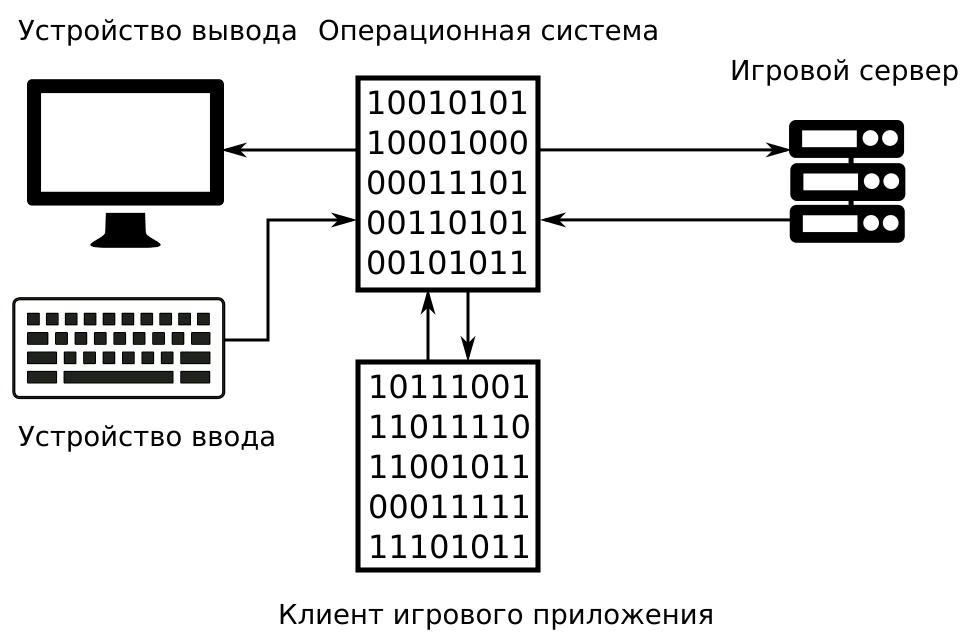

# Игровое приложение

Перед изучением внутреннего устройства ботов, рассмотрим типичное игровое приложения. Принцип его работы не зависит от игрового жанра.

Сначала мы рассмотрим [**онлайн-игру**](https://ru.wikipedia.org/wiki/%D0%9E%D0%BD%D0%BB%D0%B0%D0%B9%D0%BD-%D0%B8%D0%B3%D1%80%D0%B0). Иллюстрация 1-1 демонстрирует её логические элементы.

***Иллюстрация 1-1.** Элементы типичного приложения онлайн-игры*

Запуская игру на компьютере, вы создаете новый [**вычислительный процесс**](https://ru.wikipedia.org/wiki/%D0%9F%D1%80%D0%BE%D1%86%D0%B5%D1%81%D1%81_(%D0%B8%D0%BD%D1%84%D0%BE%D1%80%D0%BC%D0%B0%D1%82%D0%B8%D0%BA%D0%B0%29) (process). Он имеет собственную [**область памяти**](https://ru.wikipedia.org/wiki/Виртуальная_память) (memory region), которая выделяется [**операционной системой**](https://ru.wikipedia.org/wiki/%D0%9E%D0%BF%D0%B5%D1%80%D0%B0%D1%86%D0%B8%D0%BE%D0%BD%D0%BD%D0%B0%D1%8F_%D1%81%D0%B8%D1%81%D1%82%D0%B5%D0%BC%D0%B0) (ОС). Память – только один из ресурсов предоставляемых ОС. Другими ресурсами являются устройства ввода-вывода: монитор, клавиатура, мышь, сетевая плата и т.д. Процессорное время тоже относится к одному из ресурсов. Оно определяет, как часто конкретный процесс получает управление в многозадачной ОС.

Возможно, вы спросите: "Зачем нужна ОС для запуска игры? Разве не проще работать приложениям вообще без неё?" ОС – это прежде всего удобная платформа для разработки. Без неё каждой компании, создающей программы, пришлось бы изобретать собственные средства для работы с устройствами ввода-вывода. Это потребовало бы много времени и усилий. Намного проще использовать **драйвера устройств** и **системные библиотеки**, предоставляемые ОС. Кроме того ни о какой [**многозадачности**](https://ru.wikipedia.org/wiki/%D0%9C%D0%BD%D0%BE%D0%B3%D0%BE%D0%B7%D0%B0%D0%B4%D0%B0%D1%87%D0%BD%D0%BE%D1%81%D1%82%D1%8C) не могло бы идти и речи: всё процессорное время использовалось бы только одним приложением, как это было в [**MS-DOS**](https://ru.wikipedia.org/wiki/MS-DOS).

Вернемся к иллюстрации 1-1. Прямоугольники соответствуют элементам приложения, а стрелки – направлению передачи данных.

ОС обрабатывает команды работающего процесса для отображения картинки на мониторе или для отправки пакетов на сервер через сетевую плату. Также ОС уведомляет процесс о событиях на устройствах ввода. Например, нажатие клавиши на клавиатуре или получение пакета от сервера. ОС выполняет эти задачи с помощью драйверов устройств и системных библиотек. На иллюстрации они объединены в единый блок "Операционная Система".

Рассмотрим обработку однократного действия игрока. В ней участвует несколько элементов, изображенных на иллюстрации. Предположим, что мы перемещаем персонажа. Для этого нажимаем клавишу на клавиатуре. Обработка нажатия состоит из следующих шагов:

1. **Устройство ввода -> Операционная система** 
Клавиатура посылает сигнал о нажатии клавиши **контроллеру прерываний**. Это устройство передаёт сигналы в процессор в порядке очереди и с учётом приоритетов. На программном уровне они обрабатываются драйвером ОС.

2. **Операционная система -> Клиент игрового приложения** 
ОС получает от драйвера событие, соответствующее нажатию клавиши. Затем ОС передаёт его дальше: процессу игрового приложения. Обычно, событие нажатия клавиши получает процесс, окно которого является активным в данный момент. Предположим, что активно игровое приложение.

3. **Клиент игрового приложения** 
После получения события нажатия клавиши, процесс обновляет состояние игровых объектов в своей памяти. В нашем случае изменение касается местоположения персонажа.

4. **Клиент игрового приложения -> Операционная система** 
Процесс должен сообщить игровому серверу о новом местоположении персонажа. Для этого надо отправить на сервер сетевой пакет с новой информацией. Процесс обращается к ОС через системную библиотеку. Эта библиотека получает доступ к драйверу сетевой платы, который и отправляет пакет.

5. **Операционная система -> Игровой сервер** 
Игровой сервер получает сетевой пакет. Затем он проверяет, соответствует ли новая информация о персонаже игровым правилам. Если проверка прошла успешно, сервер принимает эти данные и отправляет клиенту подтверждение. Если к серверу подключено несколько клиентов, он рассылает новую информацию о персонаже им всем.

6. **Операционная система -> Клиент игрового приложения** 
Через контроллер прерываний сетевая плата посылает сигнал в процессор о получении сетевого пакета от игрового сервера. Сигнал обрабатывается драйвером. На уровне ОС создаётся соответствующее событие, которое передаётся процессу игрового приложения.

7. **Клиент игрового приложения** 
Процесс извлекает из сетевого пакета код подтверждения игрового сервера. Если код сообщает об ошибке, местоположение персонажа остается неизменным. В противном случае процесс пометит в своей памяти, что новая информация о персонаже была успешно принята сервером.

8. **Клиент игрового приложения -> Операционная система** 
Процесс игрового приложения обращается к системной библиотеке ОС (в случае Windows это обычно DirectX) для отображения на мониторе нового положения персонажа.

9. **Операционная система -> Устройство вывода** 
Библиотека ОС выполняет необходимые расчеты и обращается к драйверу видеокарты для отрисовки картинки на экране.

Практически все действия игрока выполняются по описанному алгоритму независимо от устройства ввода (клавиатура, джойстик или мышь). В случае, если не требуется подтверждение действия со стороны игрового сервера (например при открытии меню), алгоритм будет несколько отличаться.

Состояние игровых объектов может меняться как из-за действий игрока, так и из-за событий на стороне сервере (например, срабатывание таймера). Эти события будут обрабатываться по алгоритму, который состоит из рассмотренных выше шагов с шестого по девятый. В этом случае сервер уведомляет клиента об изменении. После этого процесс игрового приложения обновляет состояние объектов и перерисовывает картинку на экране.

Большинство современных онлайн-игр работают по рассмотренной нами схеме. Эта схема работы называется [**архитектурой клиент-сервер**](https://ru.wikipedia.org/wiki/%D0%9A%D0%BB%D0%B8%D0%B5%D0%BD%D1%82_%E2%80%94_%D1%81%D0%B5%D1%80%D0%B2%D0%B5%D1%80).

Иллюстрация 1-2 демонстрирует схему [**однопользовательской**](https://ru.wikipedia.org/wiki/%D0%9E%D0%B4%D0%BD%D0%BE%D0%BF%D0%BE%D0%BB%D1%8C%D0%B7%D0%BE%D0%B2%D0%B0%D1%82%D0%B5%D0%BB%D1%8C%D1%81%D0%BA%D0%B0%D1%8F_%D0%B8%D0%B3%D1%80%D0%B0) [**PC-игры**](https://ru.wikipedia.org/wiki/PC-%D0%B8%D0%B3%D1%80%D0%B0#%D0%9F%D0%B5%D1%80%D1%81%D0%BE%D0%BD%D0%B0%D0%BB%D1%8C%D0%BD%D1%8B%D0%B9_%D0%BA%D0%BE%D0%BC%D0%BF%D1%8C%D1%8E%D1%82%D0%B5%D1%80_%D0%BA%D0%B0%D0%BA_%D0%B8%D0%B3%D1%80%D0%BE%D0%B2%D0%B0%D1%8F_%D0%BF%D0%BB%D0%B0%D1%82%D1%84%D0%BE%D1%80%D0%BC%D0%B0). В отличие от онлайн-игры, здесь отсутствует сервер. Действия пользователя отражаются только на памяти процесса игрового приложения, в которой хранится состояние всех объектов.

***Иллюстрация 1-2.** Элементы типичного приложения однопользовательской PC-игры*

PC и онлайн-игры взаимодействуют с ресурсами ОС через системные библиотеки по одинаковым алгоритмам.

В случае онлайн-игры, состояние игровых объектов хранится на сервере и клиенте. При этом информация на стороне сервера более приоритетна. Это значит, что если информация клиента отличается, она будет заменена на ту, что хранится на сервере. Таким образом сервер контролирует корректность состояния игровых объектов. В случае однопользовательской PC-игры такого контроля нет.