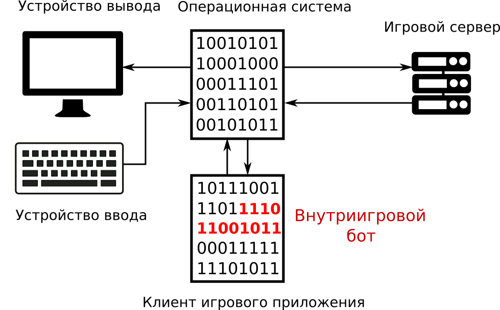
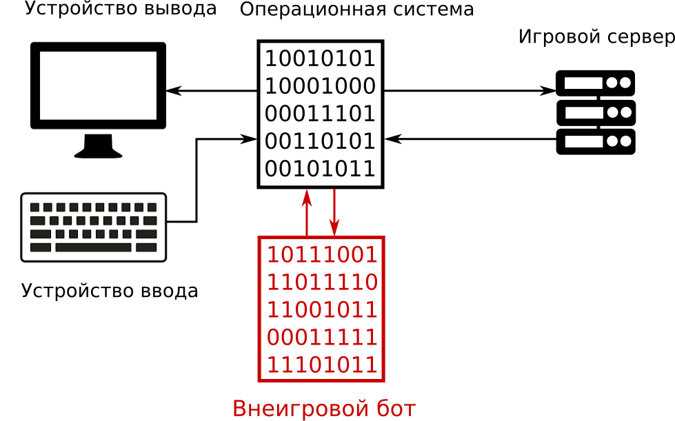
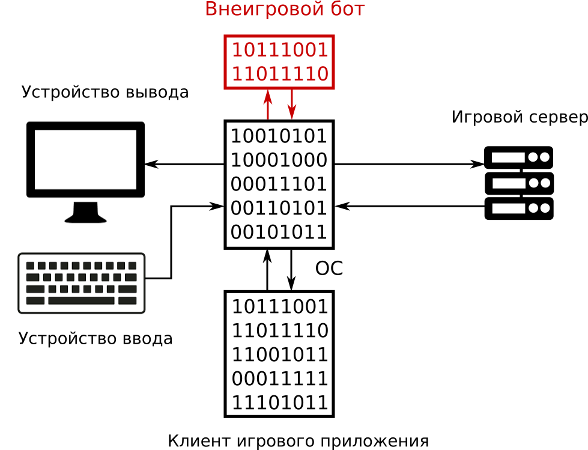
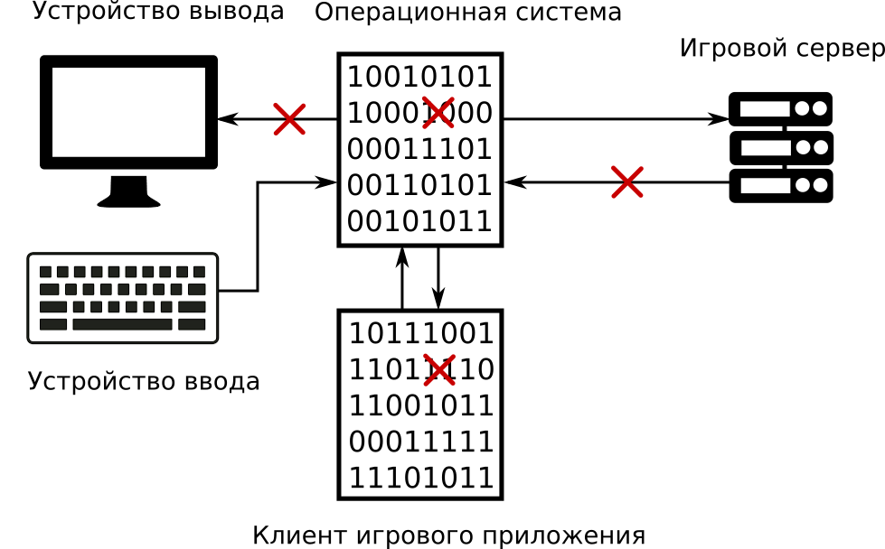
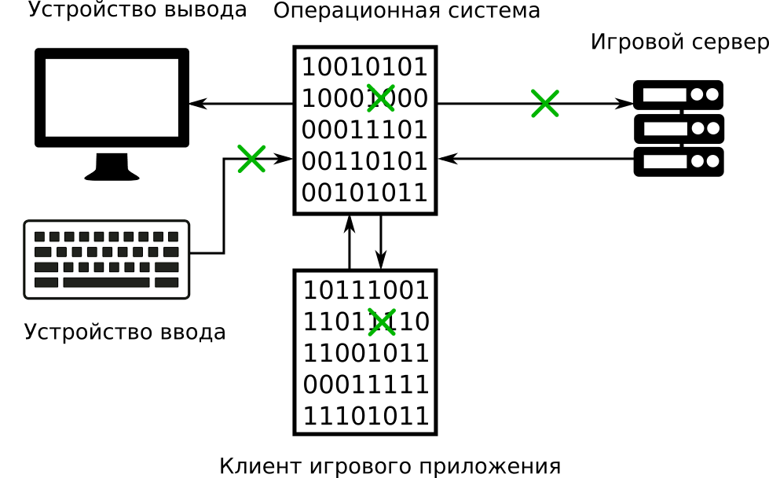

# Виды ботов

Попробуем классифицировать игровых ботов. Сразу возникает вопрос о том, по какому признаку следует относить бота к тому или иному виду. Единственного верного ответа здесь нет. Предлагаю рассмотреть ботов с двух точек зрения: их разработчиков и пользователей. Результат классификации в этих случаях получится разный.

## Классификация сообщества игроков

Изучая информацию о ботах в Интернете, вы наверняка встретите термины **внутриигровой** (in-game) и **внеигровой** (out-game). Они широко используются и означают виды ботов, которые хорошо знакомы сообществу игроков. Основа для такой классификации – это способ взаимодействия с игровым приложением.

Внутриигровые боты получили свое название из-за того, что интегрируются в игровое приложение. Иллюстрация 1-3 демонстрирует такое взаимодействие. Специальные приемы позволяют одному процессу ОС получить доступ к памяти другого процесса, либо загрузить в него произвольный исполняемый код. Таким образом бот манипулирует состоянием игровых объектов (например читает его, модифицирует и записывает обратно).

***Иллюстрация 1-3.** Схема работы внутриигрового бота*

Внеигровые боты работают отдельно от игрового приложения, как на иллюстрации 1-4. Вместо чтения данных из памяти другого процесса, они используют возможности ОС для взаимодействия между процессами или сетевыми **хостами**. Хост – это компьютер подключенный к сети (например клиент игрового приложения или сервер).

***Иллюстрация 1-4.** Внеигровой бот, работающий вместо игрового приложения*

Существует два типа внеигровых ботов. Первый тип полностью подменяет собой игровое приложение. Вместо него вы запускаете бота, который взаимодействует напрямую с сервером. Самое сложное при таком подходе заключается в том, чтобы заставить сервер принять бота за настоящее игровое приложение.

Второй тип внеигровых ботов работает одновременно с игрой. В этом случае бот собирает информацию о состоянии игровых объектов и симулирует действия пользователя через системные библиотеки ОС. Иллюстрация 1-5 демонстрирует схему такой работы.

***Иллюстрация 1-5.** Внеигровой бот, работающий одновременно с игровым приложением*

В Интернете также встречается упоминание кликеров. Их можно отнести ко второму типу внеигровых ботов. Особенность кликеров в том, что они симулируют нажатия клавиш и действия мыши через системные библиотеки ОС. При этом никакого доступа к памяти процесса игрового приложения или обмена сетевыми пакетами с сервером не происходит.

## Классификация разработчиков

Классификация сообщества игроков была создана пользователями и полностью отвечает их нуждам. Познакомившись с ней, вы можете представить себе возможности и приёмы использования каждого вида ботов. Проблема в том, что эта классификация не отражает деталей реализации. Такая информация была бы полезна для разработчиков.

Чтобы построить классификацию удобную для разработчиков, попробуем взять за основу именно детали реализации ботов. Например, к разным видам будут относиться боты, читающие состояние объектов из памяти игрового приложения, и те, которые обмениваются сообщениями с сервером.

Рассмотрим ещё раз схему приложения онлайн-игры. Отметим красными крестами точки, где бот может перехватить информацию о состоянии игровых объектов. Иллюстрация 1-6 демонстрирует результат.

***Иллюстрация 1-6.** Точки перехвата информации ботом*

Мы получили следующий список точек:

* **Устройство вывода** 
С помощью системных библиотек ОС можно перехватывать данные, отправляемые на устройства вывода (например, монитор или звуковую карту). Предположим, что игровой объект отрисовывается на экране. Он имеет определенный цвет в зависимости от своего состояния. Бот может прочитать цвета пикселей отображенной на экране картинки и получить информацию об объекте.

* **Операционная система** 
Бот может замещать или модифицировать системные библиотеки ОС или драйвера. Это позволит ему отслеживать взаимодействие игрового приложения с ОС. Альтернативное решение заключается в запуске игры в виртуальной машине или эмуляторе ОС (например Wine). Как правило, эмуляторы имеют дополнительные средства журналирования событий. Эта информация позволит боту определить состояние игровых объектов.

* **Игровой сервер** 
Сервер и клиент игрового приложения отправляют друг другу сетевые пакеты, каждый из которых содержит информацию об объектах или её часть. Перехватив достаточно пакетов, бот может сделать вывод о состоянии игры.

* **Клиент игрового приложения** 
Бот может получить доступ к памяти процесса игрового приложения и прочитать из неё информацию. Системные библиотеки ОС предоставляют функции для этого.

Главная задача любого бота – это совершать игровые действия. При этом важно, чтобы он скрывал своё присутствие. То есть игровой сервер должен принимать действия бота так, как будто их совершил пользователь. Иллюстрация 1-7 демонстрирует точки на схеме, в которых бот может внедрять свои данные в приложение.

***Иллюстрация 1-7.** Точки внедрения ботом своих данных*

Список точек получился следующий:

* **Устройство ввода** 
Если бот контролирует устройство ввода, то с точки зрения ОС это достаточно сложно распознать. Разработчик может подменить стандартную клавиатуру или мышь устройством, которое получает команды от бота, и симулирует нажатия клавиш.

* **Операционная система** 
Так же как в случае с перехватом информации, бот может подменить компоненты ОС. Например, загрузить специальный драйвер, который уведомляет ОС о нажатии клавиши. При этом драйвер будет полностью под управлением бота. Также есть системные библиотеки, которые позволяют встраивать события нажатия клавиш в процесс игрового приложения.

* **Игровой сервер** 
Бот может уведомлять сервер о своих действиях напрямую, посылая ему сетевые пакеты. Процедура их отправки может быть скопирована у игрового приложения и перенесена в код бота.

* **Клиент игрового приложения** 
Бот может встраивать свои действия и новые состояния объектов напрямую в память процесса игрового приложения. Таким образом сам игровой клиент будет обрабатывать эти действия и сообщать о них серверу.

В классификации разработчиков каждый бот может использовать одну из рассмотренных точек перехвата данных и внедрения своих действий. Таким образом мы получили 16 возможных комбинаций.

## Сравнение ботов

Таблица 1-1 отображает соответствие между классификациями разработчиков и сообщества игроков. В столбцах указаны точки перехвата данных ботом, а в строках – точки внедрения действий. На пересечении полей и строк приведены названия из классификации игроков. Например, кликеры обычно перехватывают данные игры на уровне устройств вывода, а внедряют — на уровне ОС.

***Таблица 1-1.** Соответствие классификаций*

|  | Перехват сетевых пакетов | Чтение памяти | Перехват устройств вывода | Перехват на уровне ОС |
| --- | --- | --- | --- | --- |
| Внедрение в сетевые пакеты | Внеигровые боты | – | – | – |
| Внедрение в память | – | Внутриигровые боты | – | – |
| Внедрение на уровне устройств ввода | – | – | – | – |
| Внедрение на уровне ОС | – | – | Кликеры | – |

Как видно из таблицы, классификация сообщества игроков покрывает только малую часть возможных вариантов реализаций ботов. Но эти варианты являются наиболее эффективными комбинациями точек перехвата и внедрения данных. Это не значит, что все три комбинации дают одинаковый результат. Каждая из них имеет свои достоинства и недостатки.

Перед тем как оценивать различные реализации ботов, определимся с критериями оценки. Рассмотрим три критерия:

1. Насколько трудозатратна реализация бота?

2. Насколько надёжен бот в смысле принятия верных решений?

3. Насколько сложно обнаружить бота системам защиты игры?

Кликеры наиболее просты для разработки и сопровождения. В то же время этот вид ботов наименее надёжен в использовании из-за большого количества совершаемых ошибок. Обнаружение кликеров – достаточно сложная задача для систем защиты игрового приложения.

Внеигровые боты наиболее трудоёмки для реализации. При этом их легко обнаружить. Их сильная сторона – максимальная надёжность в работе.

Внутриигровые боты являются средним вариантом между кликерами и внеигровыми ботами. Они сложнее в разработке чем первые, но проще чем вторые. Обнаружить их можно, но не так просто, как внеигровых ботов. Надёжность работы выше чем у кликеров.

Почему результаты оценки ботов получились именно такими? Чтобы ответить на этот вопрос, рассмотрим каждый вариант реализации ботов с точки зрения оценки трудоемкости разработки, надёжности и сложности обнаружения.

* **Сетевые пакеты** 
Анализ сетевых пакетов является самым сложным методом перехвата данных. Разработчик бота должен реализовать протокол взаимодействия игрового клиента и сервера. Очевидно, документация на этот протокол есть только у создателей игры. Обычно единственная доступная информация о протоколе – это перехваченные пакеты. Как правило, они зашифрованы и расшифровать их однозначно довольно сложно. С другой стороны, наиболее полная информация об игровых объектах может быть получена только напрямую от сервера. В этом случае игровой клиент ещё не успел её модифицировать или отфильтровать.

* **Память процесса игрового приложения** 
Анализ памяти процесса – второй по сложности метод перехвата данных. Разработчики игр распространяют свои приложения в виде двоичных файлов. Эти файлы генерирует **компилятор** после прохода по исходному коду игры, который представляет собой читаемый текст. Проблема в том, что процесс компиляции необратим без неоднозначностей. Кроме того, системы защиты ещё более затрудняют изучение алгоритмов и структур данных игрового приложения. С другой стороны, анализ памяти процесса даёт почти такую же полную информацию о состоянии игровых объектов, что и анализ сетевых пакетов.
Внедрять действия бота в память процесса достаточно опасно, так как это может привести к завершению приложения с ошибкой.

* **Устройства вывода** 
Перехват устройств вывода представляет собой одну из простейших техник сбора информации об игровых объектов. Но в то же время этот метод наименее надёжен. Например, алгоритмы распознавания изображений часто совершают ошибки, принимая один объект за другой. Эффективность этого подхода во многом зависит от интерфейса игры.

* **Устройства ввода** 
Внедрение действия бота через эмулятор устройства ввода является эффективной техникой для обхода систем защиты игры. С другой стороны, необходимо купить это устройство и разработать прошивку для него. Намного проще использовать внедрение действий бота на уровне ОС, если это допускает система защиты.

* **Операционная система** 
Перехват данных на уровне ОС – это универсальный и надежный метод. Существует несколько открытых проектов (например [Direct3D 9 API Interceptor](http://graphics.stanford.edu/~mdfisher/D3D9Interceptor.html)), которые позволяют подменять системные библиотеки. В этом случае игровое приложение взаимодействует с библиотеками, контролируемыми ботом. Они собирают информацию о вызываемых функциях ОС. Анализ этой информации позволит определить состояние игровых объектов.
Внедрение действий бота с помощью системных библиотек ОС достаточно просто реализовать. С другой стороны, система защиты легко обнаруживает эту технику.

В итоге мы можем заключить, что классификация сообщества игроков покрывает наиболее эффективные или простые для реализации комбинации техник перехвата и внедрения данных. В то же время она игнорирует неэффективные и редко встречающиеся комбинации. Мы будем следовать этой классификации на протяжении всей книги.

# Выводы

В этой главе мы получили общее представление о ботах и их видах. Также мы рассмотрели некоторые аспекты их реализации. Теперь вы можете легко различить кликеров, внутриигровых и внеигровых ботов. Более того, вы представляете в общих чертах, как они работают, а также их сильные и слабые стороны.