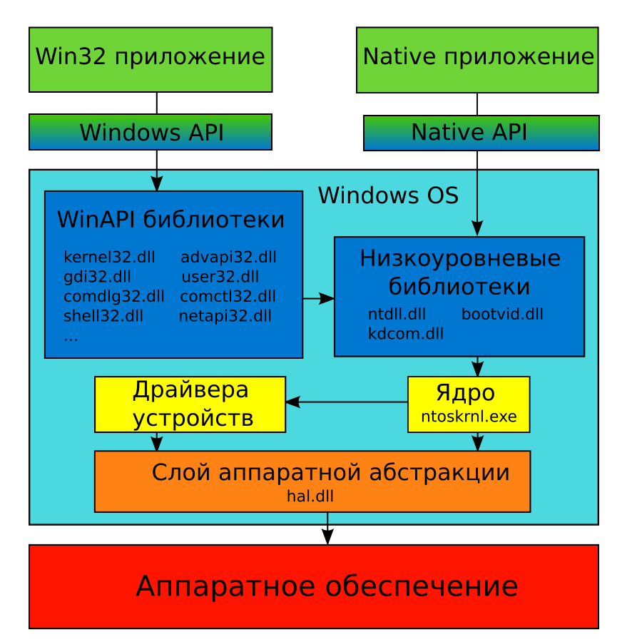

# Внедрение данных на уровне ОС

## Windows API

Главная задача любой ОС - это управление программными и аппаратными ресурсами компьютера, а также предоставление к ним доступа для запущенных процессов. Аппаратные ресурсы мы уже рассматривали. Это память, процессорное время, периферийные устройства. Примеры програмных ресурсов - примитивы синхронизации и алгоритмы, реализованные в системных библиотеках.

В этой книге мы будем рассматривать только ОС Windows. Под ней вы сможете запустить все приведённые примеры. В дальнейшем для простоты будем подразумевать Windows, когда говорим ОС.

Иллюстрация 2-1 демонстрирует, как ОС предоставляет доступ к своим ресурсам. Каждый запущенный процесс может обратиться к Windows для выполнения какого-то действия (например создание нового окна, отправки сетевого пакета, выделения дополнительной памяти и т.д.). Для каждого из этих действий у ОС есть соответствующая подрограмма. Подпрограммы, которые решают задачи из одной области (например работа с сетью), собраны в отдельные системные библиотеки. На иллюстрации приведены библиотеки *kernel32.dll*, *gdi32.dll* и другие.



**Иллюстрация 2-1.** *Доступ к ресурсам ОС через WinAPI*

Способ, которым процесс может вызвать системную подпрограмму, строго определён, хорошо задокументирован и остаётся неизменным для данной версии ОС. Такое взаимодействие можно сравнить с юридическим договором. Если процесс выполняет предварительные условия для вызова подпрограммы, ОС гарантирует указанный в документации результат. Такой договор называется **интерфейс прикладного программирования Windows** (Windwos API или WinAPI).

Программное обеспечение очень гибко и легко меняется, согласно возникающим требованиям. Например, каждое обновление Windows вносит изменения в некоторые детали реализации ОС (например какую-то системную библиотеку). Эти детали реализации связаны между собой (например одна библиотека вызывает подпрограммы другой). Таким образом, даже небольшое изменение может оказать значительное влияние на систему в целом. То же самое справедливо и для игрового приложения. Единственное, что позволяет програмному обеспечению работать в этом море  постоянных изменений - это надежные интерфейсы. Именно WinAPI гарантирует согласованное состояние системы и обеспечивает совместимость между новыми версиями ОС и приложения.

На иллюстрации 2-1 приведены два типа приложений. **Win32 приложение** взаимодействует с подмножеством системных библиотек через WinAPI интерфейс. Win32 - это историческое название которое возникло в первой 32-битной версии Windows (Windows NT). Библиотеки, доступные через WinAPI (также известные как **WinAPI библиотеки**), содержат **высокоуровневые подпрограммы**. Термин "высокоуровневый" означает, что подпрограмма оперирует сложными абстракциями, такими как окно, элемент управления, файл и т.д.

Второй тип приложений называется **нэйтив** (иногда переводится, как "родной"). Они взаимодействуют с более низкоуровневыми библиотеками Windows и ядром ОС через **нэйтив API** (Native API). Преимущество этих библиотек в том, что они становятся доступны на раннем этапе загрузки системы, когда многие функции ОС еще не работоспособны. Подпрограммы этих библиотек оперируют простыми абстракциями, такими как страница памяти, процесс, поток и т.д.

WinAPI библиотеки вызывают подпрограммы низкоуровневых библиотек. Такое подход позволяет создавать сложные абстракции из более простых. Низкоуровневые библиотеки в свою очередь вызывают функции ядра.

Драйвера предоставляют упрощенное представление устройств для системных библиотек. Это представление включает в себя набор подпрограмм, которые выполняют характерные для данного устройства действия. WinAPI и низкоуровневые библиотеки могут обратиться к этим подпрограммам через функции ядра.

**Слой аппаратной абстракции** (Hardware Abstraction Layer или HAL) - это модуль ядра ОС, который предоставляет универсальный доступ к различному аппаратному обеспечению. Главная задача HAL - облегчить портирование и сопровождение Windows на новых аппаратных платформах. Подпрограммы HAL используются ядром ОС и драйверами устройств.

## Симуляция нажатий клавиш

Теперь мы рассмотрим способы симуляции нажатий клавиш. Это наибоее простой метод контроля ботом игрового приложения.

### Нажатия клавиш в активном окне

Рассмотрим, какие возможности предлагает AutoIt для решения нашей задачи. В списке доступных функций (www.autoitscript.com/autoit3/docs/
functions.htm) есть функция `Send`. Мы воспользуемся ей в тестовом скрипте, который будет нажимать клавишу "a" в окне приложения Блокнот (Notepad).

Алгоритм работы нашего сркипта выглядит следующим образом:

1. Найти окно Блокнота среди всех открытых окон.

2. Переключится на него.

3. Симулировать нажатие клавиши "a".

Для поиска окна приложения мы воспользуемся функцией `WinGetHandle`. Её первый параметр является обязательным и может быть как заголовком окна, так и его классом. Функция возвращает **дескриптор** (handle) окна. Дескриптор - это структура данных, которая представляет некоторый ресурс или объект ОС. Большинство функций WinAPI оперируют этими структурами при работе с объектами.

Указывать класс окна при вызове функции `WinGetHandle` предпочтительнее. Всегда есть вероятность, что окна двух работающий приложений будут иметь одинаковые заголовки (например оба пустые).

Для чтения класса окна Блокнота необходимо выполнить следующие шаги:

1. Запустить приложение Au3Info. Вы можете найти его в каталоге установки AutoIt. В моем случае полный путь до приложения: `C:\Program Files (X86)\AutoIt3\Au3Info.exe`.

2. Перетащить иконку "Finder Tool" на окно Блокнота и отпустить.

3. Вы увидите результат, как на иллюстрации 2-2.


**Иллюстрация 2-2.** *Приложение AutoIt3 Info*

Класса окна Блокнота отображается на панели "Basic Info Window". Этот класс - "Notepad".

Скрипт `Send.au3`, представленный в блоке кода 2-1, реализует описанный алгоритм симуляции нажатия клавиши "a".

**Блок кода 2-1.** *Скрипт `Send.au3`*
```AutoIt
$hWnd = WinGetHandle("[CLASS:Notepad]")
WinActivate($hWnd)
Send("a")
```
В первой строчке мы получаем дескриптор окна Блокнота с помощью функции `WinGetHandle`. Далее мы переключаем фокус ввода на это окно функцией `WinActivate`. Последнее действие - симуляция нажатия клавиши "a".

Чтобы запустить этот скрипт, создайте в вашем редакторе исходного кода файл с именем `Send.au3` и скопируйте в него приведенный выше код. После этого запустите скрипт двойным щелчком по иконке этого файла.

