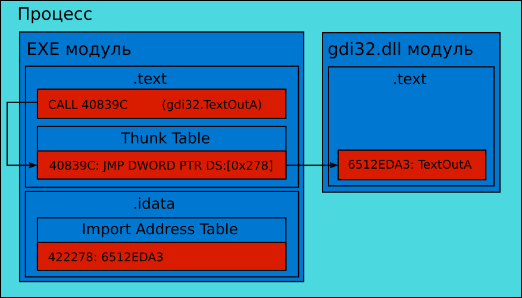

# Перехват данных на уровне ОС

В третьей главе мы рассмотрели методы чтения состояний игровых объектов из памяти процесса игрового приложения. Хорошо продуманная защита может значительно усложнить использование этих методов. В этом случае имеет смысл попробовать альтернативный подход. Подмена или модификация системных библиотек ОС позволит вам изменить точку перехвата данных. Вместо чтения памяти процесса, информацию об игровых объектах будут предоставлять динамические библиотеки, которые не контролируются защитой.

## Инструменты для разработки

Нам предстоит работа с WinAPI функциями и системными библиотеками. Лучшим языком для этой задачи является C++. Для компиляции примеров воспользуемся Visual Studio IDE. Инструкцию по её установке вы можете найти в третьей главе.

Есть несколько решений с открытым исходным кодом для перехвата вызовов WinAPI. Первое из них называется [**DLL Wrapper Generator**](https://m4v3n.wordpress.com/2012/08/08/dll-wrapper-generator) (генератор обёрток DLL). Мы будем использовать его, чтобы создавать обёртки для системных библиотек.

Для установки генератора выполните следующие шаги:

1. Скачайте архив со скриптами со [страницы проекта на Github](https://github.com/mavenlin/Dll_Wrapper_Gen/archive/master.zip).

2. Скачайте и установите [Python версии 2.7](http://www.python.org/downloads).

Второе решение, которым мы воспользуемся, называется [**Deviare**](http://www.nektra.com/products/deviare-api-hook-windows). Это [**фреймворк**](https://ru.wikipedia.org/wiki/Фреймворк) для перехвата вызовов DLL библиотек.

Для установке Deviare выполните следующее:

1. Скачайте [архив](http://github.com/nektra/Deviare2/releases/download/v2.8.0/Deviare.2.8.0.zip) с уже собранным в исполняемые файлы фреймворком.

2. Скачайте [архив](http://github.com/nektra/Deviare2/archive/v2.8.0.zip) с исходным кодом той же версии.

3. Распакуйте оба архива в разные каталоги.

Список сборок Deviare доступен на [Github странице проекта](http://github.com/nektra/Deviare2/releases). Ещё раз проверьте, что версии скачанной сборки и исходного кода совпадают.

## Тестовое приложение

Нам понадобится тестовое приложение, чтобы протестировать методы перехвата WinAPI вызовов. Предлагаю воспользоваться приложением, которое мы использовали в разделе "Методы защиты от внутриигровых ботов" третьей главы.

Немного изменённая версия исходного кода приложения приведена в листинге 5-9.

**Листинг 5-9.** *Исходный код тестового приложения*
```C++
#include <stdio.h>
#include <stdint.h>
#include <windows.h>
#include <string>

static const uint16_t MAX_LIFE = 20;
volatile uint16_t gLife = MAX_LIFE;

int main()
{
    SHORT result = 0;

    while (gLife > 0)
    {
        result = GetAsyncKeyState(0x31);
        if (result != 0xFFFF8001)
            --gLife;
        else
            ++gLife;

        std::string str(gLife, '#');
        TextOutA(GetDC(NULL), 0, 0, str.c_str(), str.size());

        printf("life = %u\n", gLife);
        Sleep(1000);
    }
    printf("stop\n");
    return 0;
}
```
Алгоритм работы приложения не изменился. Каждую секунду значение глобальной переменной `gLife` уменьшается на единицу, если клавиша "1" не была нажата. Если же была, `gLife` увеличивается на единицу. Теперь вместо вывода на консоль с помощью функции `printf`, мы делаем WinAPI вызов `TextOutA`. Он печатает строку, переданную в качестве входного параметра, в левом верхнем углу экрана. Строка состоит из символов решетки, число которых соответствует значению переменной `gLife`.

Зачем мы изменили функцию вывода информации? Наша цель заключается в перехвате WinAPI вызовов. Функция `printf` предоставляется на WinAPI, а [**библиотекой времени выполнения**](https://ru.wikipedia.org/wiki/Библиотека_среды_выполнения) языка C. В этой библиотеке реализованы низкоуровневые функции, описанные в стандарте языка. Доступ к ним возможен как из приложений, написанных на C, так и C++. После замены `printf` на `TextOutA` мы можем перехватить этот вызов. Прочитав переданные в него параметры, мы узнаем значение переменной `gLife`.

Согласно документации WinAPI, функция `TextOutA` реализована в системной библиотеке `gdi32.dll`. Эта информация пригодится нам в дальнейшем.

## Загрузка DLL библиотек

Мы собираемся рассмотреть техники перехвата WinAPI вызовов. Перед этим было бы полезно узнать, как приложение взаимодействуют с DLL библиотеками, к которым относятся и системные.

Когда мы запускаем приложение, [**загрузчик программ Windows**](https://ru.wikipedia.org/wiki/Загрузчик_программ) (PE-загрузчик) читает содержимое исполняемого файла в оперативную память. Точнее в область памяти нового процесса. Загруженный код называется **EXE модулем**. Стандартным форматом исполняемых файлов в Windows является [**PE**](https://ru.wikipedia.org/wiki/Portable_Executable). Он определяет структуру данных (известную как **PE-заголовок**), которая хранится в начале файла и содержит всю необходимую информацию для запуска его кода. Список используемых DLL библиотек является частью этой информации.

На следующем шаге PE-загрузчик ищет файлы необходимых DLL библиотек на жёстком диске. Их содержимое читается с диска и записывается в память процесса запускаемого приложения. Загруженый код библиотеки называется **DLL модулем**. Было бы логично размещать DLL модули по одним и тем же адресам на каждом запуске приложения. К сожалению, всё не так просто. Эти адреса выбираются случайно механизмом Windows под названием [**Address Space Load Randomization**](https://blogs.msdn.microsoft.com/winsdk/2009/11/30/how-to-disable-address-space-layout-randomization-aslr) (ASLR). Он защищает ОС от некоторых видов вредоносного ПО. Минус такого подхода в том, что компилятор не может использовать статические адреса для вызова функций библиотеки из EXE модуля.

Проблема решается с помощью [**Import Table**](http://sandsprite.com/CodeStuff/Understanding_imports.html) (таблица импорта). Кроме неё есть так называемая **Thunk Table** (таблица переходов). Эти таблицы часто путают. Рассмотрим, чем же они отличаются.

Import Table представляет собой массив структур типа `IMAGE_IMPORT_DESCRIPTOR`: 
```C++
typedef struct _IMAGE_IMPORT_DESCRIPTOR {
    DWORD   OriginalFirstThunk;
    DWORD   TimeDateStamp;
    DWORD   ForwarderChain;
    DWORD   Name;
    DWORD   FirstThunk;
} IMAGE_IMPORT_DESCRIPTOR, *PIMAGE_IMPORT_DESCRIPTOR;
```
Каждая такая структура соответствует одной DLL библиотеке. В поле `Name` хранится имя её файла. Число `OriginalFirstThunk` на самом деле является указателем на первый элемент массива структур типа `IMAGE_THUNK_DATA`:
```C++
typedef struct _IMAGE_IMPORT_BY_NAME {
    WORD    Hint;
    BYTE    Name[1];
} IMAGE_IMPORT_BY_NAME, *PIMAGE_IMPORT_BY_NAME;

typedef struct _IMAGE_THUNK_DATA {
    union {
        PDWORD                 Function;
        PIMAGE_IMPORT_BY_NAME  AddressOfData;
    } u1;
} IMAGE_THUNK_DATA, *PIMAGE_THUNK_DATA;
```
Ключевое слово `union` в определении `IMAGE_THUNK_DATA` говорит о том, что данные могут интерпретироваться двумя способами. Во-первых, как указатель типа `PDWORD` на функцию в памяти запщенного процесса. Во-вторых, как указатель на структуру типа `IMAGE_IMPORT_BY_NAME`, которая содержит порядковый номер функции в библиотеке и её символьное имя.

Поле `FirstThunk` структуры `IMAGE_IMPORT_DESCRIPTOR` указывает на первый элемента массива, известного как **Import Address Table** (IAT). Это таблица импорта адресов. PE-загрузчик перезаписывает её адресами функций из соответствующей загруженной DLL библиотеки. Более подробно структура Import Table описана в [русской](https://rsdn.org/article/baseserv/peloader.xml#EVH) и [английской](https://web.archive.org/web/20180616013724/http://www.ntcore.com/files/inject2it.htm#IntoImportTable1) статьях.

Import Table является частью PE-заголовка. Она содержит общую информацию о загружемых DLL библиотеках. Всё содержимое PE-заголовка загружается в сегмент памяти процесса с правами только на чтение. Thunk Table является частью исполняемого кода. Она содержит переходы (**thunk**) на импортируемые функции, которые представляют собой ассемблерные `JMP` инструкции. Thunk Table загружается в `.text` сегмент с правами на чтение и исполнение. В этом сегменте также хранится исполняемый код приложения. Import Address Table, на которую указывает `FirstThunk` элементов Import Table, помещается в сегмент `.idata` с правами только на чтение.

Некоторые компиляторы генерируют код, который не использует Thunk Table. Благодаря этому удаётся избежать накладных расходов, связанных с дополнительным `JMP` переходом. Код сгенерированный MinGW компилятором использует Thunk Table. Схема вызова импортируемой функции `TextOutA` в этом случае приведена на иллюстрации 5-1.



**Иллюстрация 5-1.** *Вызов импортированной функции в MinGW*
