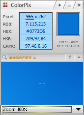
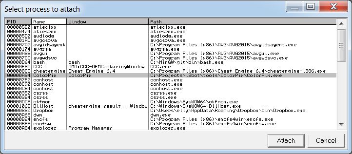
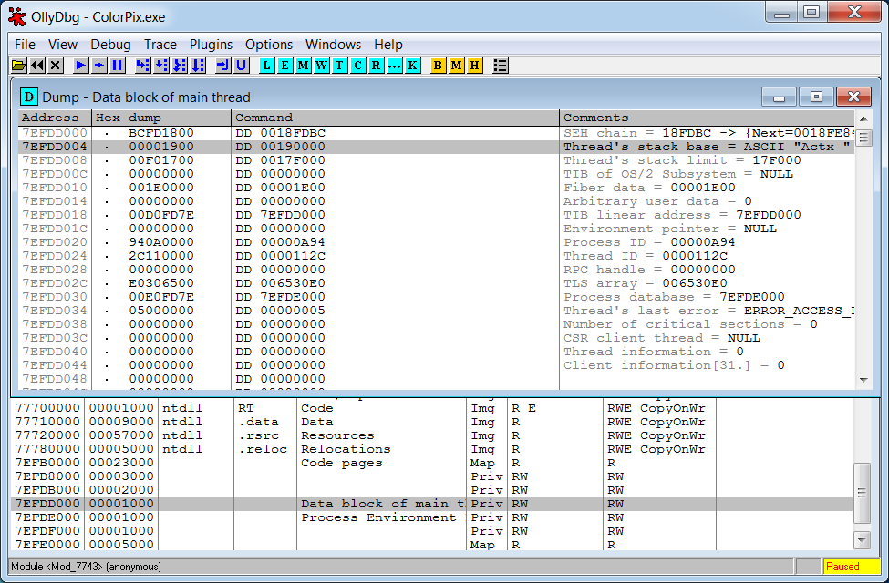
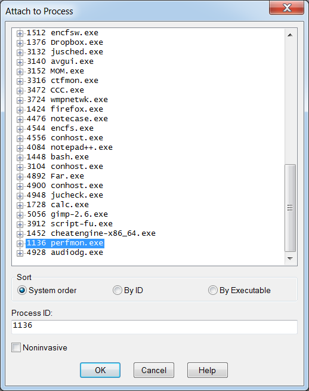

# Организация памяти процесса

Организация памяти процессов рассмотрена во многих книгах и статьях. Мы изучим только те аспекты этого вопроса, которые имеют отношение к поиску переменных в памяти, а также чтению и записи их значений.

## Адресное пространство процесса

Исполняемый EXE файл и запущенный процесс ОС – это не одно и то же. Файл – это некоторые данные, записанные на устройство хранения информации (например жесткий диск). Исполняемый файл содержит инструкции (или машинный код), которые выполняет процессор без каких либо дополнительных преобразований.

Когда вы запускаете EXE файл, ОС выполняет несколько последовательных действий. Первое – чтение его содержимого с устройства хранения и последующая запись в оперативную память (random-access memory или RAM). Благодаря этому шагу, процессор получает намного более быстрый доступ к инструкциям из файла, поскольку скорость его интерфейса с RAM на несколько порядков выше чем с любым диском.

Когда содержимое файла записано в оперативную память, ОС загружает все необходимые для его работы динамические библиотеки. После этого шага, процесс готов к выполнению. Поскольку все современные ОС для компьютеров и телефонов многозадачные, несколько процессов могут исполняться параллельно. Параллельность в данном случае не означает одновременность. То есть если у компьютера один процессор с одним ядром, он будет переключаться между процессам. В таком случае говорят о распределении процессорного времени. В многозадачных ОС этим занимается специальная программа **планировщик** (scheduler). Каждый процесс получает единицы времени (тики или секунды) в зависимости от своего приоритета.

Чем занимается запущенный процесс? Чтобы ответить на этот вопрос, заглянем в типичный исполняемый файл. В основном он содержит алгоритмы обработки и интерпретации каких-то данных. Следовательно, юольшая часть работы типичного процесса заключается в манипуляции данными.

Где процесс хранит свои данные? Мы уже знаем, что ОС всегда загружает исполняемые инструкции в оперативную память. В случае данных, процесс может свободно выбрать место их хранения. Это может быть жесткий диск, оперативная память или даже удалённый компьютер (например игровой сервер подключённый по сети). Большая часть данных, необходимых во время работы процесса копируются в оперативную память для ускорения доступа к ней. Поэтому, именно в RAM мы можем прочитать состояния игровых объектов. Они будут доступны на протяжении всего времени выполнения (runtime) процесса.

Иллюстрация 3-2 демонстрирует элементы типичного процесса. Как правило, он состоит из нескольких модулей. Обязательный из них – это EXE, который содержит все инструкции и данные, загруженные из исполняемого файла. Другие модули (обозначенные DLL\_1 и DLL\_2) соответствуют библиотекам, подпрограммы которых вызываются из EXE.


**Иллюстрация 3-2.** *Элементы типичного процесса Windows*

Все Windows приложения используют как минимум одну системную библиотеку, которая предоставляет доступ к WinAPI функциям. Даже если вы не пользуетесь WinAPI явно в своей программе, компилятор вставляет вызовы `ExitProcess` и `VirtualQuery` автоматически в ходе компиляции. Они отвечают за корректное завершение процесса и управление его памятью.

Мы рассмотрели исполняемый файл и запущенный процесс. Теперь поговорим о библиотеках с подпрограммами. Они деляться на два типа: **динамически подключаемые** (dynamic-link libraries или DLL) и **статически подключаемые** (static libraries). Главное различие между ними – это время разрешения зависимостей. Когда исполняемый файл использует подпрограмму библиотеки, говорят, что он от неё зависит.

Статически подключаемые библиотеки должны быть доступны в момент компиляции. Программа компоновщик собирает их и исполняемый файл в единый выходной файл. Таким образом, EXE модуль на иллюстрации 3-2 содержит машинный код и статических библиотек, и исполняемого файла.

Динамически подключаемые библиотеки также должны быть доступны в момент компиляции. Однако, результирующий файл на выходе компоновщика не содержит их машинный код. Вместо этого ОС ищет и загружает эти DLL библиотеки в момент запуска приложения. Если найти их не удалось, приложение завершает свою работу с ошибкой. На иллюстрации 3-2 у процесса есть два DLL модуля, соответствующие динамическим библиотекам.

Рассмотрим, как CPU выполняет инструкции процесса. Эти инструкции – элементарные шаги более сложных высокоуровневых алгоритмов. Результат выполнения каждого шага сохраняется в регистрах (или ячейках памяти) процессора и используется в дальнейшем или выгружается в оперативную память.

Запущенное приложение может использовать несколько алгоритмов в ходе своей работы. Некоторые из них могут выполняться параллельно (так же как процессы в многозадачной ОС). **Поток** (thread) – это часть машинного кода процесса, которая может выполняться независимо от других частей. Потоки взаимодействуют друг с другом (обмениваются информацией) через разделяемые ресурсы, например файл или область RAM. За выбор потока для исполнения в данный момент отвечает уже знакомый нам планировщик ОС. Как правило, число одновременно работающих потоков определяется числом ядер процессора. Но есть технологии (например hyper-threading от Intel), позволяющие более эффективно использовать мощности процессора и исполнять сразу два потока на одном ядре.

Иллюстрация 3-2 демонстрирует, что модули процесса могут содержать несколько потоков, а могут не содержать ни одного. EXE модуль всегда имеет главный поток (main thread), который первым получает управление при старте приложения.

Рассмотрим структуру памяти типичного процесса. Иллюстрация 3-3 демонстрирует **адресное пространство** процесса, состоящего из двух модулей: EXE и DLL библиотеки. Адресное пространство – это множество всех доступных процессу адресов памяти. Оно разделено на блоки, называемые **сегментами**. У каждого из них есть **базовый адрес**, длина и набор прав доступа (на запись, чтение и исполнение). Разделение на сегменты упрощает задачу контроля доступа к памяти. ОС может оперировать блоками памяти, а не отдельными адресами.


**Иллюстрация 3-3.** *Адресное пространство типичного процесса*

Процесс на иллюстрации 3-3 имеет три потока (включая главный). У каждого потока есть свой **сегмента стека**. Стек – это область памяти, организованная по принципу "последним пришёл — первым вышел" ("last in — first out" или LIFO). Она инициализируется ОС при старте приложения и используется для хранения переменных и вызова подпрограмм. В стеке сохраняется адрес инструкции, следующей за вызовом подпрограммы. После возврата из вызова процесс продолжает свое выполнение с этой инструкции.

Кроме сегментов стека, у процесса есть несколько **сегментов динамической памяти** (heap), к которым имеет доступ каждый поток.

У всех модулей процесса есть обязательные сегменты: `.text`, `.data` и `.bss`. Кроме обязательных могут быть и дополнительные сегменты (например `.rsrc`). Они не представлены на схеме 3-3. 

Таблица 3-1 кратко описывает каждый сегмент из иллюстрации 3-3. Во втором столбце приведены их обозначения в отладчике OllyDbg.

**Таблица 3-1.** *Описание сегментов*

| Сегмент | Обозначение в OllyDbg | Описание |
| --- | --- | --- |
| Стек главного потока | Stack of main thread | Содержит автоматические переменные (память под которые выделяется при входе в блок области видимости и освобождается при выходе из него), стек вызовов с адресами возврата из подпрограмм и их входные параметры. |
| Динамическая память ID 1 | Heap | Дополнительный сегмент памяти, который создаётся при переполнения сегмента динамической памяти ID 0. |
| Динамическая память ID 0 | Default heap | ОС всегда создает этот сегмент при запуске процесса. Он используется по-умолчанию для хранения переменных. |
| Стек потока 2 | Stack of thread 2 | Выполняет те же функции, что и стек главного потока, но используется только потоком 2. |
| `.text` EXE модуля | Code | Содержит машинный код модуля EXE. |
| `.data` EXE модуля | Data | Содержит статические и не константные глобальные переменные модуля EXE, которые инициализируются значениями при создании. |
| `.bss` EXE модуля | | Содержит статические и не константные глобальные переменные модуля EXE, которые не инициализируются при создании. |
| Стек потока 3 | Stack of thread 2 | То же самое, что и стек потока 2, только используется потоком 3. |
| Динамическая память ID 2 | | Дополнительный сегмент памяти, расширяющий сегмент динамической памяти ID 1 при его переполнении. |
| `.text` DLL модуля | Code | Содержит машинный код модуля DLL. |
| `.data` DLL модуля | Data | Содержит статические и не константные глобальные переменные модуля DLL, которые инициализируются значениями при создании. |
| `.bss` DLL модуля | | Содержит статические и не константные глобальные переменные модуля DLL, которые не инициализируются при создании. |
| Динамическая память ID 3 | | Дополнительный сегмент памяти, расширяющий сегмент динамической памяти ID 2 при его переполнении. |
| TEB потока 3 | Data block of thread 3 | Содержит **блок информации о потоке** (Thread Information Block или TIB), также известный как **блок контекста потока** (Thread Environment Block или TEB). Он представляет собой структуру с информацией о потоке. |
| TEB потока 2 | Data block of thread 2 | Содержит TEB структуру потока 2. |
| TEB главного потока | Data block of main thread | Содержит TEB структуру главного потока. |
| PEB | Process Environment Block | Содержит **блок контекста процесса** (Process Environment Block или PEB). Эта структура данных с информацией о процессе в целом. |
| Пользовательские данные | User Share Data | Содержит данные, которые доступны и совместно используются несколькими процессами и текущим. |
| Память ядра | Kernel memory | Область памяти, зарезервированная для нужд ОС. |

Предположим, что на иллюстрации 3-3 приведено адресное пространство процесса игрового приложения. В этом случае состояние игровых объектов может находится в сегментах, отмеченных красным цветом.

ОС назначает базовые адреса этих сегментов в момент старта приложения. Эти адреса могут отличаться от запуска к запуску. Кроме того, последовательность сегментов в памяти может также меняться. В то же время некоторые из сегментов, отмеченных синим цветом на иллюстрации 3-3 (например PEB, User Share Data и Kernel memory), имеют неизменный адрес при каждом старте приложения.

Отладчик OllyDbg позволяет прочитать структуру памяти (memory map) запущенного процесса. Иллюстрации 3-4 и 3-5 демонстрируют вывод OllyDbg для приложения, адресное пространство которого приведено на схеме 3-3.


**Иллюстрация 3-4.** *Структура памяти процесса в OllyDbg*


**Иллюстрация 3-5.** *Структура памяти процесса в OllyDbg (продолжение)*

Таблица 3-2 демонстрирует соответствие между схемой 3-3 и сегментами настоящего процесса из иллюстраций 3-4 и 3-5.

**Таблица 3-2.** *Сегменты процесса*

| Базовый адрес | Сегмент | Обозначение в OllyDbg |
| --- | --- | --- |
| 001ED000 | Стек главного потока | Stack of main thread |
| 004F0000 | Динамическая память ID 1 | Heap |
| 00530000 | Динамическая память ID 0 | Default heap |
| 00ACF000<br/>00D3E000<br/>0227F000 | Стеки вспомогательных потоков | Stack of thread N |
| 00D50000-00D6E000 | Сегменты EXE модуля "ConsoleApplication1" | |
| 02280000-0BB40000
  0F230000-2BC70000 | Дополнительные сегменты динамической памяти | |
| 0F0B0000-0F217000 | Сегменты DLL модуля "ucrtbased" | |
| 7EFAF000<br/>7EFD7000<br/>7EFDA000 | TEB вспомогательных потоков | Data block of thread N |
| 7EFDD000 | TEB главного потока | Data block of main thread |
| 7EFDE000 | PEB главного потока | Process Environment Block |
| 7FFE0000 | Пользовательские данные | User shared data |
| 80000000 | Память ядра | Kernel memory |

Возможно, вы обратили внимание, что OllyDbg не может автоматически идентифицировать все сегменты динамической памяти. С этой задачей лучше справляются отладчик WinDbg и инструмент HeapMemView.

## Поиск переменной в памяти

Внутриигровые боты читают состояния объектов из памяти процесса игрового приложения. Эти состояния могут храниться в нескольких переменных, находящихся в разных сегментах. Базовые адреса этих сегментов и смещение переменных внутри них могут меняться от запуска к запуску. Это означает, что абсолютные адреса переменных непостоянны. К сожалению, бот может читать данные из памяти только по абсолютным адресам. Следовательно, он должен уметь искать нужные ему переменные самостоятельно.

Термин "абсолютный адрес" неточен, если мы говорим о **модели сегментации памяти x86**. x86 – это архитектура процессора, впервые реализованная компанией Intel. Сегодня практически все настольные компьютеры имеют процессоры этой архитектуры. Правильный термин, который следует употреблять – "линейный адрес". Он вычисляется по следующей формуле:
```
линейный адрес = базовый адрес сегмента + смещение в сегменте
```
Мы продолжим использовать термин "абсолютный адрес", поскольку он интуитивно понятен.

Задачу поиска переменной в памяти процесса мы можем разделить на три этапа. В результате получится следующий алгоритм:

1. Найти сегмент, который содержит искомую переменную.

2. Определить базовый адрес сегмента.

3. Определить смещение переменной внутри сегмента.

Очень высока вероятность того, что переменная будет храниться в одном и том же сегменте при каждом старте приложения. Это правило не выполняется для сегментов динамической памяти, что связано с особенностью её организации. Если мы установили, что переменная не находится в сегменте динамической памяти, первый шаг алгоритма может быть выполнен вручную. Полученный результат можно закодировать в боте без каких-либо дополнительных условий и проверок. В противном случае, бот должен искать сегмент самостоятельно.

Второй шаг алгоритма бот должен всегда выполнять самостоятельно. Как мы упоминали ранее, адреса сегментов меняются при старте приложения.

Последний шаг алгоритма – найти смещение переменной в сегменте. Нет никаких гарантий, что оно не будет меняться при каждом старте приложения. Однако, смещение может оставаться тем же в некоторых случаях. Это зависит от типа сегмента, как демонстрирует таблица 3-3.

**Таблица 3-3.** *Смещение переменных в различных типах сегментов*

| Тип сегмента | Постоянство смещения |
| --- | --- |
| `.bss`<br/>`.data` | Смещение переменной не меняется при перезапуске приложения. |
| стек | В большинстве случаев смещение переменной не меняется. Но оно зависит от **порядка выполнения инструкций** (control flow). Если этот порядок меняется, смещение, скорее всего, тоже изменится. |
| динамическая память | Смещение переменной меняется при перезапуске приложения. |

Таким образом, в некоторых случаях мы можем выполнить третий шаг алгоритма вручную и закодировать результат в боте.

### Поиск переменной в 32-битном приложении

Применим алгоритм поиска переменной на практике. Выполним все его шаги вручную для приложения ColorPix, которым мы пользовались в прошлой главе для чтения цветов и координат пикселей экрана. Это поможет лучше понять все необходимые действия.

Приложения ColorPix является 32-битным. Скриншот его окна приведён на иллюстрации 3-6. Попробуем найти в памяти переменную, которая соответствует координате X выделенного на экране пикселя. На иллюстрации 3-6 она подчеркнута красной линией.



**Иллюстрация 3-6.** *Окно приложения ColorPix*

---
В ходе дальнейших действий вы не должны закрывать уже запущенное приложение ColorPix. Иначе, вам придется начать поиск переменной сначала.
---

Мы начинаем с поиска сегмента памяти, в котором хранится переменная. Эту задачу можно разделить на два этапа:

1. Найти абсолютный адрес переменной с помощью сканера памяти Cheat Engine.

2. Сравнить найденный адрес с базовыми адресами всех сегментов. Таким образом находим сегмент, в котором хранится переменная.

Чтобы найти переменную с помощью Cheat Engine, выполните следующие действия:

1. Запустите 32-битную версию сканера с правами администратора.

2. Выберите пункт главного меню "File" ➤ "Open Process". Вы увидите диалог со списком запущенных процессов (см. иллюстрацию 3-7).


**Иллюстрация 3-7.** *Диалог выбора процесса Cheat Engine*

3. Выберите процесс с именем "ColorPixel.exe" и нажмите кнопку "Open". В результате имя этого процесса отобразится в верхней части окна Cheat Engine.

4. Введите значение координаты X, которое вы видите в данный момент в окне ColorPixel, в поле "Value" окна Cheat Engine.

5. Нажмите кнопку "First Scan", чтобы найти абсолютный адрес указанного значения координаты X в памяти процесса ColorPixel.

Когда вы нажимаете кнопку "First Scan", значение в поле "Value" окна Cheat Engine, должно соответствовать тому, что отображает ColorPixel. Координата X изменится, если вы переместите курсор мыши по экрану, поэтому нажать на кнопку будет затруднительно. Воспользуйтесь комбинацией клавиш Shift+Tab, чтобы переключиться на неё и Enter, чтобы нажать.

В левой части окна Cheat Engine вы увидите результаты поиска как на иллюстрации 3-8.


**Иллюстрация 3-8.** *Результаты поиска в окне Cheat Engine*

Если в момент сканирования процесса несколько переменных имеют то же самое значение что и координата X, найденных переменных будет больше чем две. В этом случае вам надо отфильтровать ошибочные результаты. Для этого выполните следующие шаги:

1. Переместите курсор мыши, чтобы значение координаты X в окне ColorPixel изменилось.

2. Введите новую координату X в поле "Value" окна Cheat Engine.

3. Нажмите кнопку "Next Scan".

После этого в окне результатов должны остаться только две переменные как на иллюстрации 3-8. В моём случае их абсолютные адреса 0018FF38 и 0025246C. У вас они могут отличаться, но это не существенно для нашего примера.

Мы определили абсолютные адреса двух переменных, хранящих значение координаты X. Наш следующий шаг – поиск сегментов, в которых они находятся. Для этой цели воспользуемся отладчиком OllyDbg.

Для поиска сегментов выполните следующие шаги:

1. Запустите отладчик OllyDbg с правами администратора. Путь к нему по-умолчанию:<br/>
`C:\Program Files (x86)\odbg201\ollydbg.exe`.

2. Выберите пункт главного меню "File" ➤ "Attach". Вы увидите диалог со списком запущенных 32-битных процессов (см. иллюстрацию 3-9).



**Иллюстрация 3-9.** *Диалог выбора процесса в отладчике OllyDbg*

3. Выберите процесс "ColorPix" в списке и нажмите кнопку "Attach". Когда отладчик подключится к нему, вы увидите состояние "Paused" в правом нижнем углу окна OllyDbg.

4. Нажмите комбинацию клавиш Alt+M, чтобы открыть окно, отображающее структуру памяти процесса ColorPix. Это окно "Memory Map" приведено на иллюстрации 3-10.


**Иллюстрация 3-10.** *Окно "Memory Map" со структурой памяти процесса*

Переменная с абсолютным адресом 0018FF38 хранится в сегменте стека главного процесса ("Stack of main thread"), который занимает адреса с 0017F000 по 00190000.

---
OllyDbg отображает только адрес начала сегмента и его размер. Чтобы вычислить конечный адрес, вы должны сложить два эти числа. Результат будет равен адресу начала следующего сегмента.
---

Вторая найденная нами переменная с адресом 0025246C находится в сегменте с базовым адресом 00250000, тип которого неизвестен. Найти его будет труднее чем сегмент стека. Поэтому мы продолжим работу с первой переменной.

Последний шаг поиска – расчёт смещения переменной в сегменте стека. Стек в архитектуре x86 растёт вниз. Это означает, что он начинается с больших адресов и расширяется в сторону меньших. Следовательно, базовый адрес стека равен его верхней границе (в нашем случае это 00190000). Нижняя границе стека может меняться по ходу его увеличения.

Смещение переменной равно разности базового адреса сегмента, в котором она находится, и её абсолютного адреса. В нашем случае мы получим:
```
00190000 - 0018FF38 = C8
```
Для сегментов динамической памяти, `.bss` и `.data` это вычисление выглядело бы иначе. Все они растут вверх (в сторону больших адресов), поэтому их базовый адрес соответствует нижней границе.

Теперь у нас есть вся необходимая информация, чтобы найти и прочитать координату X в любом запущенном процессе ColorPix. Алгоритм для бота, который бы это делал, выглядит следующим образом:

1. Прочитать базовый адрес сегмента стека главного потока. Этот адрес хранится в TEB сегменте.

2. Вычесть смещение переменной (всегда равное C8) из базового адреса сегмента стека. В результате получим её абсолютный адрес.

3. Прочитать значение переменной из памяти процесса ColorPix по её абсолютному адресу.

Корректность первого шага алгоритма мы можем проверить вручную с помощью отладчика OllyDbg. Он позволяет прочитать информацию сегмента TEB в удобном виде. Для этого дважду щелкните по сегменту, который называется "Data block of main thread", в окне "Memory Map" отладчика. Вы увидите окно как на иллюстрации 3-11.



**Иллюстрация 3-11.** *Окно OllyDbg с информацией TEB*

Базовый адрес сегмента стека 00190000 указан во второй строчке открывшегося окна. Этот адрес может меняться при каждом запуске приложения.

### Поиск переменной в 64-битном приложении

Применим наш алгоритм поиска переменной для 64-битного приложения.

---
Отладчик OllyDbg не поддерживает 64-битные приложения, поэтому вместо него будем использовать WinDbg.
---

Resource Monitor (монитор ресурсов) Windows 7 будет нашим приложением для анализа. Он распространяется вместе с ОС и доступен сразу после её установки. Разрядность Resource Monitor совпадает с разрядностью Windows. Чтобы запустить приложение, откройте меню Пуск (Start) Windows и введите следующую команду в строку поиска:
```
perfmon.exe /res
```
Иллюстрации 3-12 демонстрирует окно Resource Monitor.


**Иллюстрация 3-12.** *Окно приложения Resource Monitor*

Найдём переменную, хранящую размер свободной памяти системы. На иллюстрации её значение подчёркнуто красной линией.

Прежде всего найдём сегмент, содержащий искомую переменную. Для этого воспользуемся 64-битной версией сканера Cheat Engine. Интерфейс его 64 и 34-битных версий одинаков, поэтому вам нужно выполнить те же действия, что и при анализе приложения ColorPixel.

В моем случае найдены две переменные с адресами 00432FEC и 00433010. Определим сегменты, в которых они хранятся. Чтобы прочитать структуру памяти процесса с помощью отладчика WinDbg, выполните следующие действия:

1. Запустите 64-битную версию WinDbg с правами администратора. Путь к нему по-умолчанию:<br/>
`C:\Program Files (x86)\Windows ­Kits\8.1\Debuggers\x64\windbg.exe`.

2. Выберите пункт главного меню “File" ➤ “Attach to a Process...”. Откроется окно диалога со списком запущенных 64-разрядных процессов как на иллюстрации 3-13.



**Иллюстрация 3-13.** *Диалог выбора процесса в отладчике WinDbg*

3. Выберите в списке процесс "perfmon.exe" и нажмите кнопку "OK".

4. В командной строке отладчика, расположенной в нижней части окна "Command", введите текст `!address` и нажмите Enter. Структура памяти процесса отобразится в окне "Command" как на иллюстрации 3-14.


**Иллюстрация 3-14.** *Вывод структуры памяти процесса в окне "Command"*

Обе переменные с абсолютными адресами 00432FEC и 00433010 находятся в сегменте динамической памяти с ID 2. Границы этого сегмента: с 003E0000 по 00447000. Смещение первой переменной в сегменте равно 52FEC:
```
00432FEC - 003E0000 = 52FEC
```
Для бота алгоритм поиска переменной, хранящей размер свободной памяти ОС в приложении Resource Monitor, выглядит следующим образом:

1. Прочитать базовый адрес сегмента динамической памяти с ID 2. Необходимо воспользоваться WinAPI функциями прохода по сегментам этого типа:
    * CreateToolhelp32Snapshot
    * Heap32ListFirst
    * Heap32ListNext

2. Добавить смещение переменной (в моем случае равное 52FEC) к базовому адресу сегмента. В результате получится её абсолютный адрес.

3. Прочитать значение переменной из памяти процесса.

Мы упоминали, что смещение переменной в сегменте динамической памяти, как правило, меняется при перезапуске приложения. В случае если приложение достаточно простое (как рассматриваемый нами Resource Monitor), порядок выделения динамической памяти может быть одним и тем же при каждом старте программы.

Попробуйте перезапустить Resource Monitor и найти переменную еще раз. Вы получите то же самое её смещение в сементе, равное 52FEC.

## Выводы

Мы рассмотрели адресное пространство Windows процесса. Затем составили алгоритм поиска переменной в памяти и применили его к 32 и 64-разрядному приложениям. В ходе этого мы познакомились с функциям анализа структуры памяти отладчиков OllyDbg и WinDbg.
