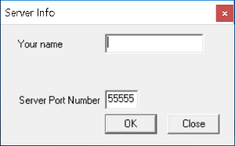
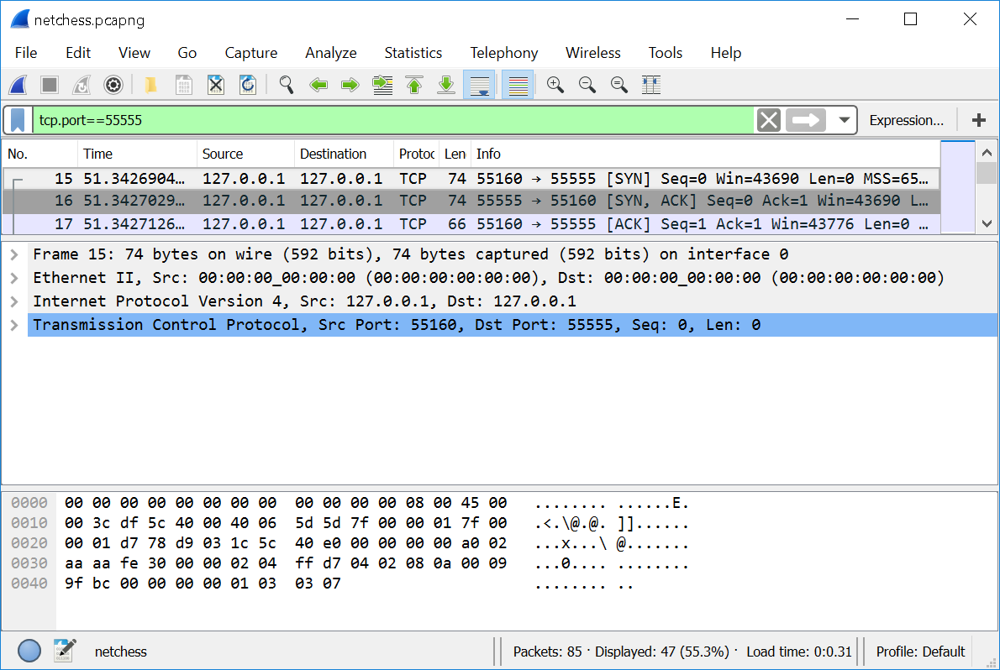
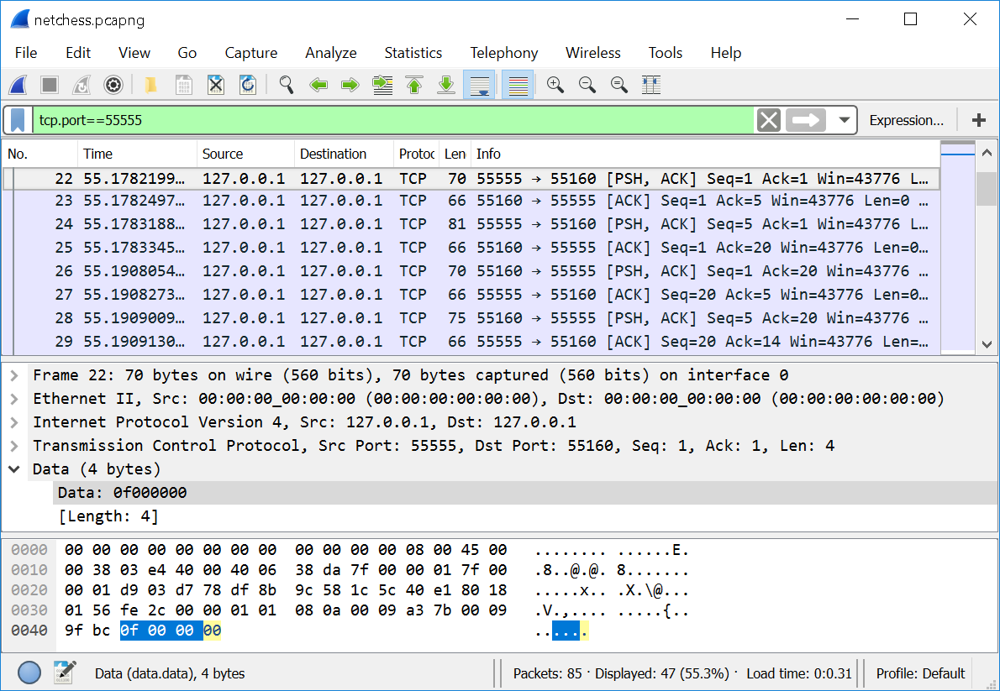
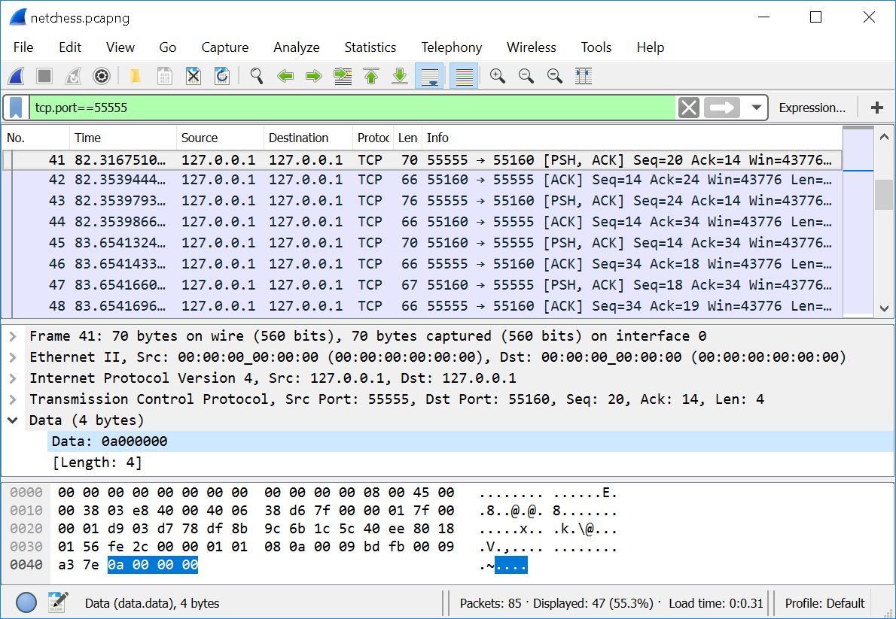

# Пример бота для Net Chess

Мы узнали достаточно, чтобы написать простого внеигрового бота. Он будет делать ходы в шахматной программе NetChess. Эта программа состоит клиента и сервера и позволяет играть по локальной сети. Вы можете бесплатно скачать её на сайте [Sourceforge](https://sourceforge.net/projects/avmnetchess). Чтобы установить игру, просто распакуйте архив с ней в любой каталог.

Рассмотрим интерфейс игры. Её главное окно изображено на иллюстрации 4-11. Большую его часть занимает шахматная доска с фигурами на ней. Главное меню находится в верхней части окна. Ряд иконок под меню дублирует часть его функций.


**Иллюстрация 4-11.** *Окно NetChess*

Чтобы начать игру, необходимо запустить приложение NetChess и назначить ему роль сервера. После этого второй игрок запускает приложение на другом компьютере в роли клиента. Он подключается к серверу, и игра начинается. Благодаря loopback интерфейсу можно запустить клиент и сервер на одном хосте.

Чтобы запустить NetChess и начать игру выполните следующие действия:

1. Дважды запустите исполняемый файл `NetChess2.1.exe` из каталога `Debug` игры. В результате запустится два процесса NetChess. Выберите из них тот, который будет настроен в роли сервера. Тогда другой будет исполнять роль клиента.

2. Переключитесь на окно сервера и выберите пункт меню "Network" ➤ "Server" ("Сеть" ➤ "Сервер"). Откроется диалог конфигурации приложения в роли сервера, как на иллюстрации 4-12.



**Иллюстрация 4-12.** *Диалог конфигурации сервера*

3. Введите имя пользователя, который играет на стороне сервера, и нажмите кнопку "OK".

4. Переключитесь на окно приложения NetChess, выполняющее роль клиента. Выберите пнкт меню "Network" ➤ "Client" ("Сеть" ➤ "Клиент"). Откроется диалог конфигурации клиента, как на иллюстрации 4-13.


**Иллюстрация 4-13.** *Диалог конфигурации клиента*

5. Введите имя пользователя на стороне клиента и IP-адрес сервера (в моём случае это 169.254.144.77). Затем нажмите кнопку "OK".

6. Переключитесь на окно сервера. Когда клиент попытается подключится, должен открыться диалог "Accept" (принять), как на иллюстрации 4-14. В нём вы должны выбрать цвет фигур (чёрный, белый, случайный). После этого нажмите кнопку "Accept" (принять).


**Иллюстрация 4-14.** *Диалог подключения клиента*

7. Переключитесь на окно клиента. Вы увидите сообщение об успешном поключении к серверу. В нём выводится имя оппонента и цвет его фигур (см иллюстрацию 4-15).


**Иллюстрация 4-15.** *Диалог подтверждения подключения*

8. Переключитесь на окно сервера и выберите пункт меню "Edit" ➤ "Manual Edit" ➤ "Start Editing" ("Редактирование" ➤ "Ручное редактирование" ➤ "Начать редактирование"). Откроется диалог с подтверждением в котором вы должны нажать кнопку "Yes" (да). После этого приложение перейдёт в режим, в котором вы сможете запустить игровые часы.

9. Переключитесь на окно клиента и подтвердите включение режима "Manual Edit" в открывшемся диалоге. Для этого нажмите кнопку "Yes".

10. Переключитесь на окно сервера. Вы увидите сообщение, что клиент подтвердил включение режима "Manual Edit". Закройте сообщение нажатием кнопки "OK". Затем уберите галочку с пункта меню "Edit" ➤ "Manual Edit" ➤ "Pause clock" ("Редактирование" ➤ "Ручное редактирование" ➤ "Остановить часы").

Игровые часы запустятся, и белая сторона может сделать первый ход. Чтобы сделать ход достаточно перетащить мышью нужную фигуру на новую клетку доски.

## Обзор бота

Наш внеигровой бот будет подключаться к серверу и полностью замещать собой приложение NetChess, выполняющее роль клиента.

Есть несколько способов, как бот может выбирать свои ходы. Предлагаю остановиться на самом простом решении, поскольку мы рассматриваем взаимодействие с игровым сервером, а не алгоритмы шахматных программ. Наш бот будет зеркально повторять ходы игрока до тех пор, пока это позволяют праивла игры. Задача выглядит достаточно простой, но потребует изучения протокола NetChess.

Проект NetChess распространяется с открытым исходным кодом. Вы можете изучить код и быстро разобраться в протоколе приложения. Мы выберем другой путь. Давайте предположим, что NetChess - проприетарная игра, и её исходный код не доступен. Для исследования у нас есть только перехваченный сетевой трафик между клиентом и сервером.

## Изучение трафика NetChess

Мы рассмотрели шаги, необходимые для установки соединения между клиентом и сервером NetChess, а также чтобы начать игру. Теперь мы можем перехватить трафик и найти сетевые пакеты, соответствующие каждому из этих шагов. Перед этим рассмотрим два важных вопроса.

Как мы будем отличать трафик NetChess от остальных приложений в Wireshark логе? Если бы мы использовали сетевую плату вместо loopback интерфейса, в лог попали бы пакеты всех работающих в данный момент сетевых приложений. Пакеты NetChess мы можем отличить по номеру порта. Мы указали его при настройке серверной части приложения. По-умолчанию он равен 55555. Применим следующее условие на проверку порт в качестве Wireshark фильтра:
```
tcp.port==55555
```
Теперь в логе будет выводиться только трафик NetChess.

Следующий вопрос: как именно следует перехватывать трафик? Самый простой и очевидный путь - запустить Wireshark, начать прослушивать lopback интерфейс и сыграть подряд несколько игр. Поступив так, мы потеряем важную информацию, которая очень пригодилась бы для изучения трафика. В Wireshark логе, собранном по нескольким играм, будет очень сложно различить отдельные ходы каждой стороны. Наример, какой именно пакет соответствует первому ходу белых? В логе десятки пакетов, а мы не можем даже сказать в какой именно момент началась каждая игра. Чтобы избежать этого затруднения, будем проверять Wireshark лог после каждого совершённого действия. В этом случае мы сразу увидим соответствующие ему пакеты.

Теперь запустим Wireshark, NetChess клиент и сервер. Начнём прослушивание loopback интерфейса в анализаторе. После этого выполните следующие действия:

1. Запустите NetChess в режиме сервера (настройка “Network” ➤ “Server”). После этого действия приложение только открывает сокет. Поэтому в логе Wireshark новых пакетов не появится.

2. Подключитесь NetChess клиентом к серверу (настройка “Network” ➤ “Client”). В Wireshark окне появятся три пакета, как на иллюстрации 4-16. Это установка TCP соединения через тройное рукопожатие.



**Иллюстрация 4-16.** *Установка соединения между NetChess клиентом и сервером*

3. Сервер принимает соединение клиента. После этого анализатор перехватит два пакета, отправленные сервером. На иллюстрации 4-17 их номера 22 и 24. Клиент подтверждает их получение и сам посылает два пакета с данными (с номерами 26 и 28).

Отсановимся в этом месте и рассмотрим пакеты с данными, которыми обмениваются клиент и сервер после установки соединения. Первый пакет от сервера под номером 22 содержит следующие данные:
```
0f 00 00 00
```
Попробуйте перезапустить NetChess клиент и сервер. После этого снова установите соединение между ними. Данные, передаваемые в этом пакете не изменятся. Вероятнее всего, на прикладном уровне модели TCP/IP они означают, что сервер принял соединение клиента. Чтобы проверить это предположение, попробуйте отклонить подключение клиента на сервере. В этом случае данные пакета изменятся на следующие:
```
01 00 00 00
```
Из этого следует, что наше предположение верно. Если первый байт равен 0f, значит соединение принято сервером. Иначе этот байт равен 01.



**Иллюстрация 4-17.** *Подтверждение подключения NetChess сервером*

Второй пакет от сервера с номером 24 содержит следующие байты данных:
```
0b 02 46 6d e7 5a 73 72 76 5f 75 73 65 72 00
```
Эти байты соответствуют случаю, когда игрок на стороне сервера выбрал белые фигуры и ввёл имя "srv_user". Wireshark способен частично декодировать эти данные. Согласно иллюстрации 4-18, байты с 7-ого по 15-ый соответствуют имени пользователя.


**Иллюстрация 4-18.** *Декодирование данных второго пакета от сервера в Wireshark*

Что означают первые шесть байт в ответе сервера? Попробуйте перезапустить NetChess клиент и сервер, чтобы проверить изменяться ли байты в следующий раз. Не забудьте выбрать то же имя пользователя "srv_user" и белые фигуры на стороне сервера. В этом случае уже известные нам байты данных не изменятся.

После перезапуска NetChess, у меня получились следующие данные в пакете:
```
0b 02 99 b3 ee 5a 73 72 76 5f 75 73 65 72 00
```
Обратите внимание, что первые два байта (0b и 02) не изменились. Скорее всего, в них закодирован цвет фигур, который выбрал игрок на стороне сервера. Попробуйте перезапустить NetChess и выбрать черные фигуры. Данные этого пакета поменяются:
```
0b 01 ba 45 e8 5a 73 72 76 5f 75 73 65 72 00
```
Если повторить тест с выбором чёрных фигур несколько раз, второй байт всегда будет равен 01. Это подтверждает наше предположение. Цвет фигур игрока на стороне сервера кодируется согласно таблице 4-2. Исходя из этой информации, наш бот может установить цвет своих фигур.

**Таблица 4-2.** *Кодирование цвета фигур игрока на стороне сервера*

| Байт | Цвет |
| --- | --- |
| 01 | Чёрный |
| 02 | Белый |

Следующие два пакета с данными отправляются клиентом. Первый из низ под номером 26 содержит следующие байты:
```
09 00 00 00
```
Они не изменяться, если мы перезапустим приложение и попробуем поменять имя игрока на стороне сервера или цвет его фигур. Поэтому предположительно эти байты кодируют неизменный ответ клиента.

Следующий пакет под номером 28 содержит следующие данные:
```
0c 63 6c 5f 75 73 65 72 00
```
Wireshark декодирует эти байты, начиная со второго, как имя игрока на стороне клиента (см. иллюстрацию 4-19). Значение первого байта неясно. Оно не меняется после перезапуска приложения. Бот может обращаться с ним, как с константой, и всегда включать в свой ответ серверу.


**Иллюстрация 4-19.** *Декодирование данных второго пакета от клиента в Wireshark*

Продолжим действия в приложении NetChess, необходимые для начала игры. Следующий шаг - включение режима "Manual Edit" на стороне сервера ("Edit" ➤ "Manual Edit" ➤ "Start Editing"). После этого действия сервер отправляет два пакета клиенту.

Первый пакет под номером 41 на иллюстрации 4-20 содержит следующие данные:
```
0a 00 00 00
```
Вероятнее всего певрый байт 0a соответствует коду запроса сервера.
Данные второго пакета под номером 43 выглядят так:
```
13 73 72 76 5f 75 73 65 72 00
```
Мы уже встречали байты со 2-ого по 9-ый и знаем, что они соответствуют строке "srv_user". Первый же байт со значением 13 не меняется и наш бот может его игнорировать.

Когда клиент подтверждает включение режима "Manual Edit", он отвечает двумя пакетам с номерами 45 и 47 на иллюстрации 4-20. Их данные следующие:
```
01 00 00 00
17
```
При получение запроса сервера 0a, наш бот должен повторить этот ответ без изменений.



**Иллюстрация 4-20.** *Включение режима "Manual Edit" сервером*

Последнее действие, чтобы начать игру, - это включение часов. Ему соответствует отправка сервером двух пакетов с номерами 54 и 56 на иллюстрации 4-21. Данные этих пакетов следующие:
```
02 00 00 00
22 00
```
Клиент не отвечает на эти пакеты, поэтому наш бот может их просто проигнорировать.
