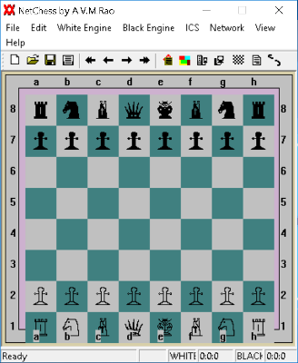
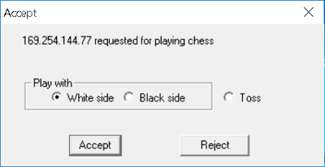
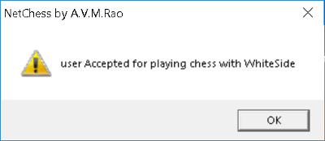

# Пример бота для Net Chess

Мы узнали достаточно, чтобы написать простого внеигрового бота. Он будет делать ходы в шахматной программе NetChess. Эта программа состоит клиента и сервера и позволяет играть по локальной сети. Вы можете бесплатно скачать её на сайте [Sourceforge](https://sourceforge.net/projects/avmnetchess). Чтобы установить игру, просто распакуйте архив с ней в любой каталог.

Рассмотрим интерфейс игры. Её главное окно изображено на иллюстрации 4-11. Большую его часть занимает шахматная доска с фигурами на ней. Главное меню находится в верхней части окна. Ряд иконок под меню дублирует часть его функций.

**Иллюстрация 4-11.** *Окно NetChess*

Чтобы начать игру, необходимо запустить приложение NetChess и назначить ему роль сервера. После этого второй игрок запускает приложение на другом компьютере в роли клиента. Он подключается к серверу, и игра начинается. Благодаря loopback интерфейсу можно запустить клиент и сервер на одном хосте.

Чтобы запустить NetChess и начать игру выполните следующие действия:

1. Дважды запустите исполняемый файл `NetChess2.1.exe` из каталога `Debug` игры. В результате запустится два процесса NetChess. Выберите из них тот, который будет настроен в роли сервера. Тогда другой будет исполнять роль клиента.

2. Переключитесь на окно сервера и выберите пункт меню "Network" ➤ "Server" ("Сеть" ➤ "Сервер"). Откроется диалог конфигурации приложения в роли сервера, как на иллюстрации 4-12.

**Иллюстрация 4-12.** *Диалог конфигурации сервера*

3. Введите имя пользователя, который играет на стороне сервера, и нажмите кнопку "OK".

4. Переключитесь на окно приложения NetChess, выполняющее роль клиента. Выберите пнкт меню "Network" ➤ "Client" ("Сеть" ➤ "Клиент"). Откроется диалог конфигурации клиента, как на иллюстрации 4-13.

**Иллюстрация 4-13.** *Диалог конфигурации клиента*

5. Введите имя пользователя на стороне клиента и IP-адрес сервера (в моём случае это 169.254.144.77). Затем нажмите кнопку "OK".

6. Переключитесь на окно сервера. Когда клиент попытается подключится, должен открыться диалог "Accept" (принять), как на иллюстрации 4-14. В нём вы должны выбрать цвет фигур (чёрный, белый, случайный). После этого нажмите кнопку "Accept" (принять).

**Иллюстрация 4-14.** *Диалог подключения клиента*

7. Переключитесь на окно клиента. Вы увидите сообщение об успешном поключении к серверу. В нём выводится имя оппонента и цвет его фигур (см иллюстрацию 4-15).

**Иллюстрация 4-15.** *Диалог подтверждения подключения*

8. Переключитесь на окно сервера и выберите пункт меню "Edit" ➤ "Manual Edit" ➤ "Start Editing" ("Редактирование" ➤ "Ручное редактирование" ➤ "Начать редактирование"). Откроется диалог с подтверждением в котором вы должны нажать кнопку "Yes" (да). После этого приложение перейдёт в режим, в котором вы сможете запустить игровые часы.

9. Переключитесь на окно клиента и подтвердите включение режима "Manual Edit" в открывшемся диалоге. Для этого нажмите кнопку "Yes".

10. Переключитесь на окно сервера. Вы увидите сообщение, что клиент подтвердил включение режима "Manual Edit". Закройте сообщение нажатием кнопки "OK". Затем уберите галочку с пункта меню "Edit" ➤ "Manual Edit" ➤ "Pause clock" ("Редактирование" ➤ "Ручное редактирование" ➤ "Остановить часы").

Игровые часы запустятся, и белая сторона может сделать первый ход. Чтобы сделать ход достаточно перетащить мышью нужную фигуру на новую клетку доски.

## Обзор бота

Наш внеигровой бот будет подключаться к серверу и полностью замещать собой приложение NetChess, выполняющее роль клиента.

Есть несколько способов, как бот может выбирать свои ходы. Предлагаю остановится на самом простом решении, поскольку мы рассматриваем взаимодействие с игровым сервером, а не алгоритмы шахматных программ. Наш бот будет зеркально повторять ходы игрока до тех пор, пока это позволяют праивла игры. Задача звучит очень простой, но
